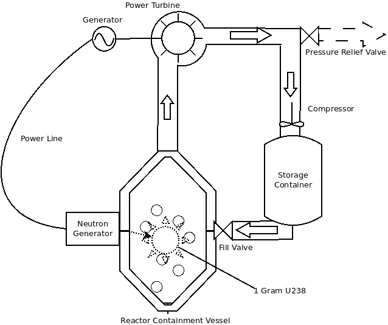
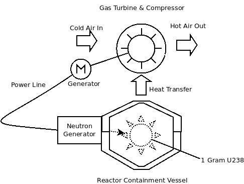

# OpenReactor
Safe &amp; Clean Nuclear Power, For Everyone!

## About

OpenReactor is a nano reactor designed to demonstrate how safe and inexpensive nuclear power can be. The planned reactor will use less than 1 gram of depleted uranium making it one of the smallest, and safest reactors on the planet. The reactor runs sub-critical requiring a neutron generator to operate which is in turn powered by the reactor. While this reduces the efficiency of the reactor, it greatly improves the safety, and combined with the incredibly small quantity of uranium, this reactor is the most environmentally friendly powerplant in the world. This reactor is designed to supply the energy needs of a single household for decades without refueling allowing it to be used to power small homesteads without producing large quantities of waste.

In fact, because of how this reactor works, it could actually be used to reduce existing stockpiles of waste radioactive material by burning it as a fuel into harmless elements.

## Basic Concept

The reactor is a very simple design. The fuel (in this case, depleted uranium) is suspended in the reactor containment vessel. Externally mounted to the vessel is a neutron generator which pumps the fuel with high energy neutrons causing fission. This fission releases a lot of energy in the form of heat. There are two primary cycles that are being developed, the first utilizes a traditional Rankine cycle to generate power using the heat to make steam to power a turbine. 

 

The second option proposes the use of the Brayton cycle to power a gas turbine. The gas turbine has an advantage in terms of portability as well as the ability to generate thrust in addition to turning a generator.  

In the event of damage to the containment vessel or the circuit, the turbine will cease to operate which will cause both the neutron generation and fission to cease. Furthermore, the low quantity of radioactive material present is so low as to be exempt from most regulations meaning in the worst case scenario with complete destruction of the containment vessel and release of reactor core into the environment, the long-term environmental impact is negligible.

In spite of this fact, however, short term radiation risks from high energy photons during reactor operation do exist, and proper shielding is necessary to ensure safety during the operation of this reactor. 

## Shielding

Shielding is always incredibly important any time you are dealing with nuclear radiation. Most reactors use several feet of concrete, lead, and special materials to shield operators from the radiation, and while this is possible with our design as well, we also have the benefit of size on our side. A typical nuclear reactor uses fuel rods that are [four meters long!](https://www.world-nuclear.org/information-library/nuclear-fuel-cycle/nuclear-power-reactors/nuclear-power-reactors.aspx), however our fuel pellet is less than 2 cubic inches. this means that we can take advantage of the small size to offer very robust shielding without greatly increasing the cost or weight. This is promising because it could mean portable applications such as producing the power for an electric car or truck.

### Alpha Radiation

There is unlikely to be any alpha radiation that escapes the containment vessel, and if it does, it's generally harmless to everyone, so this form of radiation will be naturally shielded by the containment vessel.

### Beta Radiation

This form of radiation is a bit more dangerous, but it can be shielded fairly easily. The U238 will release ~6.5MeV in the form of beta particles. Most of these particles will be unlikely to escape the stainless steel containment vessel. With that said, beta particles can penetrate up to 5-10mm of most materials, and can produce bremsstrahlung radiation. Bremsstrahlung radiation can be shielded [using an additional 2mm of lead](https://pubmed.ncbi.nlm.nih.gov/17228183/) making an effective (and, probably overkill) Beta barrier to be ~12mm of lead. This is also without accounting for the inherent shielding properties of the water/steam or other materials that are within the containment vessel or the vessel itself.

### Gamma Radiation

This is one of the most dangerous types of ionizing radiation. In the nuclear fission of uranium, you typically have 7MeV of both prompt and delayed gamma photons. Our reactor produces 50kW of thermal energy which requires ~900,000 fissions. To make calculations easy, I will ignore the inverse square law and assume the shielding is both in direct contact with the source, and a flat plane. This will undoubtedly increase the amount of shielding necessary, but it provides a nice safety margin as well. I will also be assuming someone is dumb enough to be sitting directly on top of the containment vessel in these shielding calculations as it is desirable to minimize this down for portable power purposes such as vehicles.

Every second we are generating 8.1E11 high energy photons, both prompt and delayed. This is equivalent to 5.67E12 MeV/second. 1 rad/rem is 6.24E7 MeV/gram, a rough approximation of the amount of rems is 90,836.3 rems/second based on the gamma conversion factor of 1. That is, this reactor will produce at most 327,010,573.5 rems/hour or ~3 million sieverts. This is the theoretical max exposure one could receive assuming they had perfectly absorbed the totality of gamma radiation created by the reactor for one hour. This is many times over the amount needed to kill you, in case the prior warnings and common sense weren't sufficient enough to figure that out. 

X = YE-upx
X = Exposure with shield (R/hr)
Y = Exposure without shield (R/hr)
u = Mass attenuation coefficient (cm2/g)
p = density (g/cm3)
x = thickness (cm)

Y = 327,010,573.5
u  = [2.989E-02](https://physics.nist.gov/PhysRefData/XrayMassCoef/ElemTab/z82.html) (cm2/g)
p = 11.35 (g/cm3)

Using these values, a spreadsheet was made which allowed me to determine that 38cm or roughly 1.3 feet of lead was sufficient to shield gamma radiation in compliance with NRC lifetime cumulative exposure applied over an 80 year period, the length of exposure which would exceed this quantity is 109 years. This shielding also complies with the shielding requirements for the general public, and well within the limits of exposure for pregnant women and children [These calculations were based on these equations.](https://www.nrc.gov/docs/ML1122/ML11229A721.pdf)

